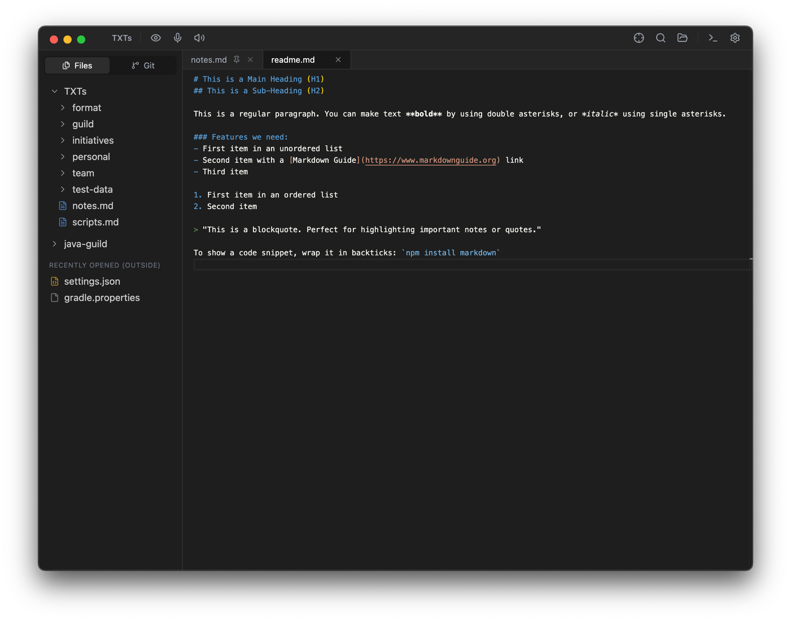

# AuraPad

A fast, lightweight text and code editor for macOS, Windows, and Linux. Open a folder, edit
files, commit your changes — AuraPad stays out of your way. No plugins to configure, no
accounts, no telemetry: even voice dictation and read-aloud run entirely on your machine.



## Download & Install

**macOS / Linux** — one command installs (or updates) the latest release and starts it:

```bash
curl -fsSL https://raw.githubusercontent.com/roman-struchev/aura-pad/main/scripts/install.sh | bash
```

**Windows** — download the `-setup.exe` from the
[latest release](https://github.com/roman-struchev/aura-pad/releases/latest).

> **macOS:** a `.dmg` downloaded in a browser shows "AuraPad is damaged" (builds aren't
> notarized yet). Use the command above instead, or run `xattr -cr /Applications/AuraPad.app`.

## Highlights

- **Real editor engine** — Monaco (the editor behind VS Code): syntax highlighting for ~25
  languages, multi-cursor editing, find & replace.
- **Voice dictation** — press `Cmd+D`, speak, and the text lands at the cursor. Powered by
  Whisper running on-device; audio never leaves your machine.
- **Read aloud** — have any document read to you with natural neural voices, with automatic
  language switching and 1×/1.5×/2× speed.
- **Translate in place** — select text and hit `Option+Cmd+T`: Google Translate for best
  quality, or fully offline local models.
- **Git built in** — status badges, diffs, branch switching, stage/commit/push/pull without
  leaving the editor.
- **Run HTTP requests** — press `Cmd+Enter` on a `curl` command anywhere, keep
  `.http`/`.rest` files next to your code, or fill in a request in the HTTP Client tab; the
  response lands beside the editor, and every call is kept in a local history.
- **Work Together** — share a live link to any open tab; others edit or view it in a
  plain browser, no install needed.
- **Instant startup, small footprint** — opens folders and megabyte-sized files without
  ceremony.

## Features

**Editing**

- Syntax highlighting for ~25 languages (46 file extensions), multi-cursor editing,
  find & replace.
- Pull a tab out into a window of its own — drag it off the strip, or `Shift+Cmd+D` /
  right-click → Move to New Window. That window is just the tab and the editor: no file
  tree, no git panel, no terminal. Drag it out again (or right-click → Move Back to Main
  Window) and it returns to the main window, taking the empty window with it.
- Tabs with pinning and drag-to-reorder; reopen the last closed tab with `Cmd+Shift+T`.
  With more tabs than fit, the strip scrolls (wheel included), always keeps the
  active tab in view, and the chevron at its end lists every open tab.
  Tabs can be switched off entirely for a one-file-at-a-time view.
- Autosave a moment after you stop typing.
- Error checking for TypeScript, JavaScript, and Python; uses your project's own ESLint
  setup if it has one.
- One-click Markdown and HTML preview; format JSON/HTML/XML with `Option+Cmd+L`.
- Opens files that aren't UTF-8 (cp1251, UTF-16, …) and writes them back in their original
  encoding instead of corrupting them.
- Themes: dark, light, system, Monokai, and Solarized; adjustable UI density, line numbers,
  and sidebar side.

**Voice & language**

- **Dictation** (`Cmd+D`): speak, and the text appears at the cursor. Works fully offline —
  speech recognition (Whisper) runs on your machine.
- **Read aloud**: natural-sounding voices read your document, switching between English and
  Russian automatically. Also fully offline (Piper). Speed toggle 1×/1.5×/2×, `Esc` stops.
- **Translate** (`Option+Cmd+T` or right-click a selection): Google Translate for best
  quality, or local offline models if the text should never leave your machine.
- Voice and translation models are downloaded once (after you confirm) and cached for
  offline use.

**Files**

- Open several folders side by side in one tree.
- Create, rename, and delete files; drag them between folders to move them. Drop a file in
  from Finder/Explorer to open it.
- Copy & paste files and folders (`Cmd+C` / `Cmd+V`), including several at once —
  `Cmd`-click to add a row, `Shift`-click for a range. The clipboard is the system one on
  macOS, so a file copied in Finder pastes into the tree and vice versa.
- Quick open with a double-tap of `Shift`; full-text search across all folders
  (`Shift+Cmd+F`), with match case, whole word, regular expressions and a file filter
  (`*.ts, src/**`). Only one search dialog is ever open: switching between quick open and
  search-in-files carries the typed query across.
- Replace across files (`Shift+Cmd+R`, or the arrow next to the search field): every match
  previews the line as it will be written, files are unchecked one by one, and one Undo
  puts the whole batch back. Files with unsaved edits in a tab are skipped and say so —
  their next autosave would write the old text straight back.
- Stays in sync with changes made outside the app — and warns instead of losing your
  unsaved edits.
- Files opened from outside the workspaces (Finder, "Open With…") stay in a "Recently
  Opened" list in the sidebar.
- Respects `.gitignore`. Files up to 10 MB open in the editor; full-text search scans
  files up to 2 MB.

**Git**

- See changed files at a glance, view diffs, stage, commit (or amend), push, and pull —
  right in the editor (`Cmd+K`).
- Switch branches and browse the commit history without leaving the panel.
- Works with several repos open at once; can be turned off entirely in Settings.

**Terminal**

- A real terminal inside the app: multiple tabs, resizable panel, opens at any folder from
  the file tree.
- `Cmd+K` with the cursor in the terminal clears its scrollback (the same key toggles the
  Git panel everywhere else); the shell keeps running and a half-typed command survives.

**HTTP requests**

- Run a `curl` command straight from any file — a **▶ Run** button appears above it (in a
  `.md`, a `.sh`, a scratch note, anywhere), or press `Cmd+Enter` with the cursor inside it.
  Multi-line commands pasted from a terminal or browser devtools work as they are. The
  button only shows up where the command can actually run: a `curl … | bash` from a README
  needs a shell, and this client never uses one.
- `.http` / `.rest` request files (the JetBrains HTTP Client / VS Code REST Client format):
  requests separated by `###`, `@variables` with `{{placeholders}}`, and a **▶ Run** button
  above every request. They're plain text, so they live in git next to the code.
- An **HTTP Client tab** for one-off requests (sidebar → Extensions): pick the method,
  type the URL, add headers and a body, hit Send. It can also fill itself in from a `curl`
  command on the clipboard, and hand one back.
- The response opens beside the editor (or below the form): status, time and size, the body
  (JSON and XML pretty-printed, images shown as images), every response header, and one
  click to copy any of it — or to copy the request back out as a `curl` command.
- **History** of the last 50 requests, whichever way they were sent. Click one to load the
  whole request — method, URL, headers, body, redirect and TLS options — back into the form
  and re-run it. The list is hidden until you ask for it (the clock icon in the tab's
  options row); the choice sticks. It is stored locally in the app's data directory and
  keeps the headers you sent (so re-running works) — clear it from the tab when that
  matters.
- Requests are parsed, never handed to a shell, so opening someone else's `.http`/`.rest`
  file and pressing Run can't execute anything but an HTTP request.
- No ambient state: the client sends exactly what the request says. It keeps no cookie jar
  and reuses no browser session, so a session-cookie API needs its `Cookie` header written
  out (`-b`, or a `Cookie:` line).

**Work Together**

- Share any open tab as a live link — others edit or read it in a regular browser, no
  install needed, with read-only/read-write and an expiry you set.
- Off by default; the backend URL is pre-filled with a hosted instance, or point it at
  your own. Self-hostable backend:
  [aura-server](https://github.com/roman-struchev/aura-server). The contract a backend
  must implement is in [docs/edit-together/specification.md](docs/edit-together/specification.md).

**Google Tasks**

- Your Google task lists in a tab: add, complete, reorder, and edit tasks alongside your
  files. Off until you enter your own Google OAuth client id/secret in Settings.

**Updates**

- The app checks for new releases in the background. On Windows (and Linux AppImage) it
  downloads and installs them itself; on macOS it re-runs the install script above, since
  these builds aren't signed — the toast follows the download percentage while it does.

The full list of keyboard shortcuts is available in the app under Settings → Shortcuts.

## Development

Install deps and run in dev mode.

```bash
npm install
npm run dev
```

Checks:

```bash
npm run smoke      # launches the app against a throwaway profile and drives it
npm run typecheck
npm run lint
npm run format
```

`npm run smoke` is the test suite — 111 checks over the baseline behavior
(opening and editing files, tabs, tree operations, encodings, search, previews,
terminal, settings, git, HTTP requests) in about 35 seconds. What it can't reach (native menu
accelerators, native dialogs, OAuth, the updater) is a manual checklist in
[docs/TEST_CASES.md](docs/TEST_CASES.md).

Build for your platform:

```bash
npm run build:mac    # or build:win / build:linux
```

Release a new version (bumps the minor version, tags, and pushes — CI builds and publishes):

```bash
npm run release
```
